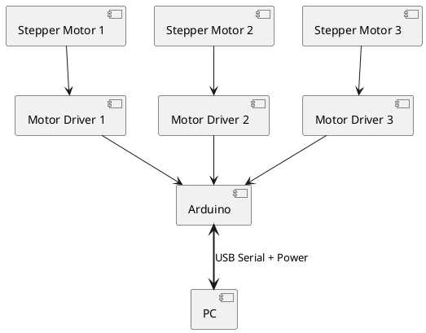
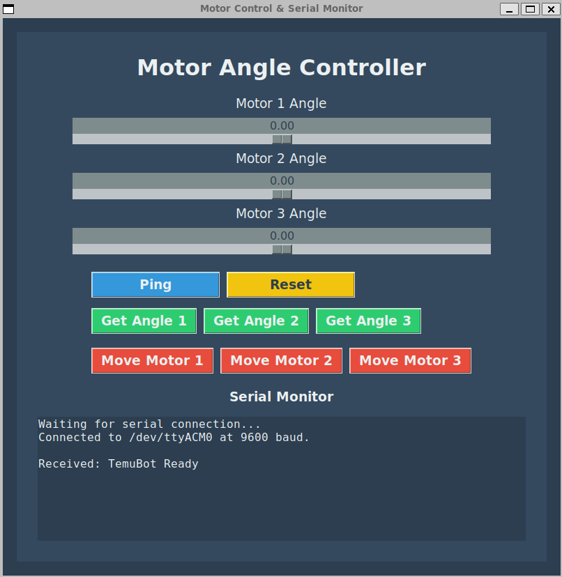

# TemuBot

TemuBot is a simple robot with 3 rotational joints powered by 3 stepper motors and an Arduino.

## Parts List

- ELEGO UNO R3 "Arduino"
- ELEGOO 28BYJ-48 5V Stepper Motors x3
- ULN2003 Stepper Motor Driver Boards x3
- 5mm Rigid Flange Coupling Connectors x3
- 170 point solderless plug in breadboard
- Assorted flexible jumper wires

## Diagram

## Commands & Responses

Commands are sent to the Arduino as text strings through the serial port.
Responses are received from the Arduino also as text strings.
The serial communication protocol is "9600 8N1" which means:
- baud rate of 9600 bits per second
- 8 data bits
- no parity
- 1 stop bit

Note:
- Motor angles can be positive or negative to accomodate forward (clockwise) and reverse (counter-clockwise) rotations.
- Motor angles can be any size to accomodate multiple rotations (i.e. 720.0 represents 2 full clockwise rotations.)
- Motor angles are in degrees and are floating point numbers.

| Command               | Response
| --------------------- | -----------------------
| ping                  | OK
| get angle 1           | motor angle 1 is #.#
| get angle 2           | motor angle 2 is #.#
| get angle 3           | motor angle 3 is #.#
| reset angle 1         | motor angle 1 is #.#
| reset angle 2         | motor angle 2 is #.#
| reset angle 3         | motor angle 3 is #.#
| move motor 1 relative | motor 1 moved to angle #.#
| move motor 2 relative | motor 2 moved to angle #.#
| move motor 3 relative | motor 3 moved to angle #.#
| move motor 1 absolute | motor 1 moved to angle #.#
| move motor 2 absolute | motor 2 moved to angle #.#
| move motor 3 absolute | motor 3 moved to angle #.#

Where #.# represents a floating point number.

## GUI

The Python GUI provided supports a motor range from -720 degrees to +720 degrees and can command only one motor to move at a time.

